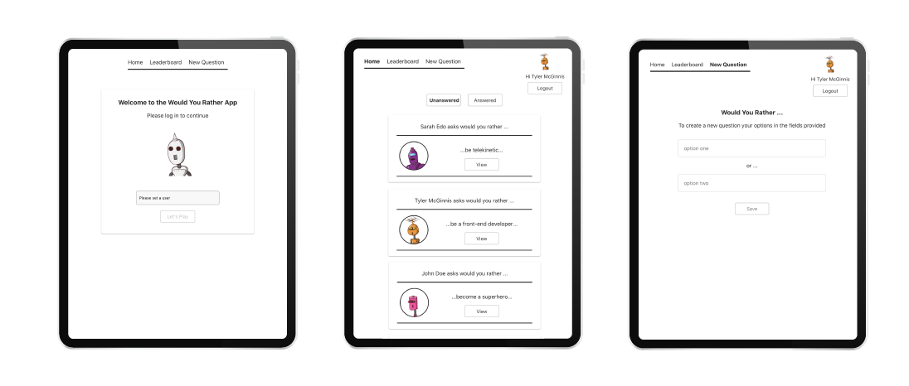

# Udacity React Nanodegree: Would You Rather?

## Project Overview
This project was done as part of the requirements to complete the Udacity React Nanodegree program.
The application is built using React and implements Redux for state management.

### Would You Rather?
In the "Would You Rather?" app a user is able to play the “Would You Rather?” game. The game goes like this: A user is asked a question in the form: “Would you rather [option A] or [option B] ?”. Answering "neither" or "both" is against the rules.
Users are able to answer questions, see which questions they haven’t answered, see how other people have voted, post questions, and see the ranking of users on the leaderboard.

### Project Set Up
1. To install the project please run the following
> npm install

2. To build the project please run the following
> npm start
This will run the app in the development mode. 
Open [localhost:3000](http://localhost:3000) to view it in the browser.

#### Create React App
This project was bootstrapped with [Create React App](https://github.com/facebook/create-react-app)

#### Avatar Images
Images used throughout the application are hosted by [gravatar](https://en.gravatar.com/site/implement/images/) 
